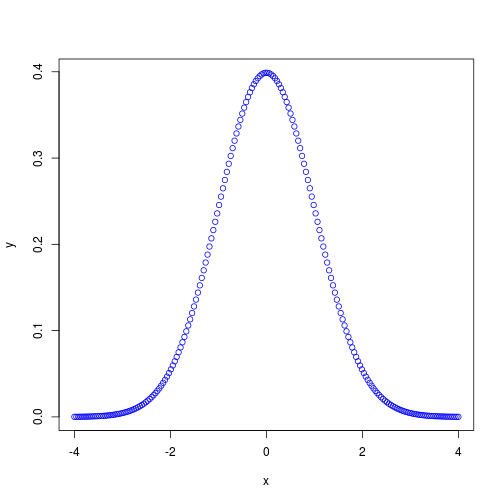
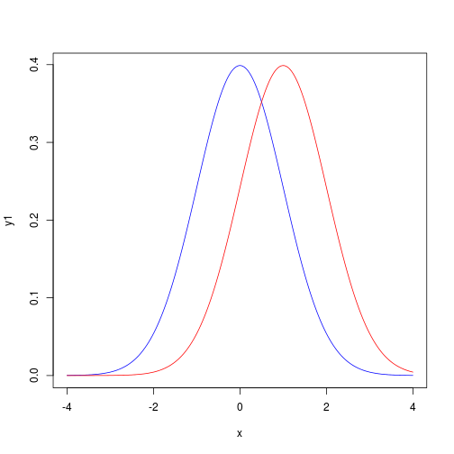

# Introduction to simple plots and statistics in R

# A sample dataset

Let's open a sample data set to work with:


```r
clotData <- read.table("data/clot.txt")
```

```
## Warning: cannot open file 'data/clot.txt': No such file or directory
```

```
## Error: cannot open the connection
```


# Summary statistics

## General summary

The `summary` function provides a simple way to get a standard set statistics:


```r
summary(clotData)
```

```
## Error: object 'clotData' not found
```


## Summary by factor

What if we wanted individual summaries of the data for each drug type?


```r
by(clotData, INDICES = clotData$drugType, FUN = summary)
```

```
## Error: object 'clotData' not found
```


What happened there?

## Aggregate by a factor

How can we make a new table with just average clot times for each drug?


```r
aggregate(clotData$clotTime, by = list(Drug = clotData$drugType), FUN = mean)
```

```
## Error: object 'clotData' not found
```


What happened there?

# Simple plots

## The plot function is magic!


```r
plot(clotData)
```

```
## Error: object 'clotData' not found
```


This is a [box plot](http://en.wikipedia.org/wiki/Box_plot).

## Simple x,y plot


```r
plot(c(1, 2, 3, 4), c(2, 3, 4, 5))
```

 


## Simple f(x) plot


```r
plot(function(x) {
    x * 4
})
```

 


## Simple f(x) plot


```r
plot(function(x) {
    x^2
})
```

 


## Let's plot a normal distribution in blue


```r
x <- seq(-4, 4, length = 200)
y <- dnorm(x, mean = 0, sd = 1)
plot(x, y, col = "blue")
```

 


## Two plots on one graph

```r
x <- seq(-4, 4, length = 200)
y1 <- dnorm(x, mean = 0, sd = 1)
y2 <- dnorm(x, mean = 1, sd = 1)
plot(x, y1, type = "l", col = "blue")
lines(x, y2, col = "red")
```

 


# A simple t-test

## Let's look at those box plots again:


```r
plot(clotData)
```

```
## Error: object 'clotData' not found
```


Are the sample means different?

## The t-test {stats}


```r
help(t.test)
help.search("t.test")
```


## The formula expression


```r
library(stats)
t.test(clotData$clotTime ~ clotData$drugType)
```

```
## Error: object 'clotData' not found
```


## The data.frame shortcut


```r
# This line should cause an error
t.test(clotTime ~ drugType, data = clotdata)
```

```
## Error: object 'clotdata' not found
```

```r

# Corrected
t.test(clotTime ~ drugType, data = clotData)
```

```
## Error: object 'clotData' not found
```

